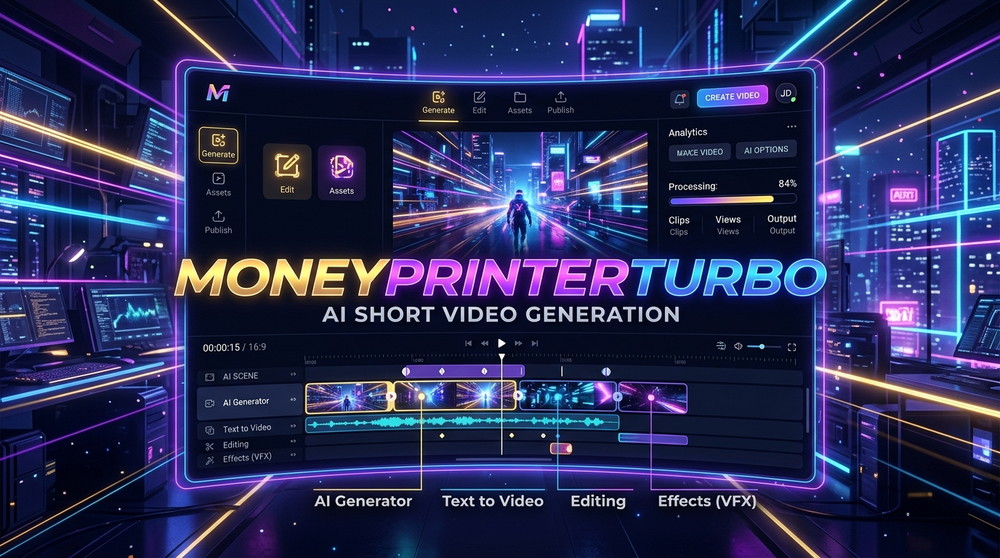

<div align="center">



[](https://github.com/ermradulsharma/money-printer-turbo/releases)
[](https://www.python.org/)
[](LICENSE)
[](https://github.com/ermradulsharma/money-printer-turbo/releases)

[**Documentation**](README.md) • [**Releases**](https://github.com/ermradulsharma/money-printer-turbo/releases) • [**Issues**](https://github.com/ermradulsharma/money-printer-turbo/issues)

[**Quickstart**](#-quickstart) • [**Features**](#-features--supported-ecosystem) • [**System Requirements**](#-system-requirements) • [**API & CLI**](#-api--cli-reference) • [**Colab Notebook**](https://colab.research.google.com/github/ermradulsharma/money-printer-turbo/blob/main/docs/MoneyPrinterTurbo.ipynb)

---

</div>
**MoneyPrinterTurbo** is an all-in-one AI short video creation suite. Simply provide a **topic** or **keywords**, and it automatically orchestrates script writing, visual material acquisition, text-to-speech voiceover, subtitle alignment, background music, and HD rendering.

- ✍️ **AI Scripting**: Generates multi-scene video scripts and media search prompts.
- 🎥 **Visual Footage Engine**: Matches stock footage (Pexels, Pixabay, Coverr) or generates AI visuals (WaveSpeed / Seedance T2V).
- 🎙️ **Voice & Subtitles**: Multi-provider TTS (Edge TTS, Azure, ElevenLabs, Fish Audio, etc.) with Whisper timestamped subtitles.
- 🎵 **Audio Mixing**: Blends background music dynamically.
- 🎬 **Dual Aspect Ratios**: Supports 9:16 Shorts/Reels/TikTok and 16:9 Landscape.
- 🚀 **1-Click Auto Publishing**: Posts directly to TikTok, Instagram & YouTube Shorts.

---

## ⚡ Features & Supported Ecosystem

| Category | Supported Services & Providers |
| :--- | :--- |
| 🧠 **LLM Providers** | **Kimi / Moonshot AI**, **OpenAI (GPT-4o/5)**, **Anthropic Claude**, **Google Gemini**, **DeepSeek**, **Qwen**, **Azure OpenAI**, **ByteDance VolcEngine Ark**, **Grok**, **MiniMax**, **Ollama**, **OneAPI**, **LiteLLM**, **Groq**, **Cloudflare AI Gateway** |
| 🎙️ **Voice Synthesis (TTS)** | **Edge TTS** (Free), **Azure Speech**, **SiliconFlow**, **Google Gemini**, **Xiaomi MiMo**, **ElevenLabs**, **Fish Audio**, **Chatterbox** |
| 🎥 **Stock & AI Footage** | **Pexels**, **Pixabay**, **Coverr**, **WaveSpeed AI** (Seedance T2V Text-to-Video generation), **Local Video/Image Uploads** |
| 🎵 **Audio & Subtitles** | **Whisper / faster-whisper** transcription, Edge subtitle timestamps, Custom background music mixing |
| 📱 **Auto Publishing** | **Upload-Post API** integration for 1-click posting to TikTok, Instagram & YouTube Shorts |
| 🛠️ **Interfaces** | **AI Agent (Skill)**, **WebUI (Streamlit)**, **RESTful API (FastAPI)**, **CLI** |

---

## 💻 System Requirements

| Component | Minimum | Recommended | Optimal |
| :--- | :--- | :--- | :--- |
| **OS** | Windows 10+, macOS 11+, or Linux | Windows 11 / macOS 12+ | Linux / Windows Server |
| **CPU** | 4 Cores | 6 - 8 Cores | 8+ Cores |
| **RAM** | 4 GB | 8 GB | 16+ GB |
| **GPU** | Optional (Not required) | 4 GB VRAM | 8+ GB VRAM (for fast local Whisper/video rendering) |
| **Python** | 3.11+ | 3.11 | 3.11 |

---

## 🚀 Quickstart

### Option 1: Docker Deployment (Recommended) 🐳

```bash
# Clone the repository
git clone https://github.com/ermradulsharma/money-printer-turbo.git
cd MoneyPrinterTurbo

# Launch container
docker compose -f docker-compose.release.yml up -d
```
- 🌐 **WebUI Dashboard**: `http://localhost:8501`
- 📖 **API Documentation**: `http://localhost:8080/docs`

---

### Option 2: Local Installation (uv / venv) 📦

Requirements: **Python 3.11+** & **FFmpeg**

```bash
# 1. Clone repository
git clone https://github.com/ermradulsharma/money-printer-turbo.git
cd MoneyPrinterTurbo

# 2. Setup Python environment and dependencies with uv
uv python install 3.11
uv sync --frozen

# 3. Launch WebUI Dashboard
# On Windows:
.\webui.bat
# On macOS / Linux:
sh webui.sh

# 4. Launch Backend API Server
uv run python main.py

# 5. Run via Command Line Interface (CLI)
uv run python cli.py --video-subject "Artificial Intelligence in Daily Life"
```

---

### Option 3: Google Colab Notebook ☁️

Run directly in your browser without local setup:

[](https://colab.research.google.com/github/ermradulsharma/money-printer-turbo/blob/main/docs/MoneyPrinterTurbo.ipynb)

---

### Option 4: AI Agent Integration 🤖

If your AI Agent supports reading Skill documents, send it the prompt below:

```text
Use this Skill: https://raw.githubusercontent.com/ermradulsharma/money-printer-turbo/main/docs/skill/SKILL.md
Help me generate a short video with the topic "How Artificial Intelligence is Changing Daily Life".
```

---

## 📖 API & CLI Reference

### RESTful API (FastAPI)
Start the API server:
```bash
uv run python main.py
```
- Open Swagger Docs: `http://localhost:8080/docs`
- Main Endpoint: `POST /v1/video/generate`

### Command Line (CLI)
```bash
uv run python cli.py --help
```
Generate video with options:
```bash
uv run python cli.py \
  --video-subject "Future of Renewable Energy" \
  --video-aspect "9:16" \
  --voice-name "en-US-AvaNeural"
```

---

## ⚙️ Configuration

Copy `config.example.toml` to `config.toml` to customize your API keys and defaults:

```bash
cp config.example.toml config.toml
```

You can set your LLM provider (`moonshot`, `openai`, `gemini`, `deepseek`, `ollama`, etc.), stock API keys (Pexels, Pixabay), and TTS configuration directly in `config.toml` or via the WebUI settings dashboard.

---

## 📜 License

This project is licensed under the [MIT License](LICENSE).